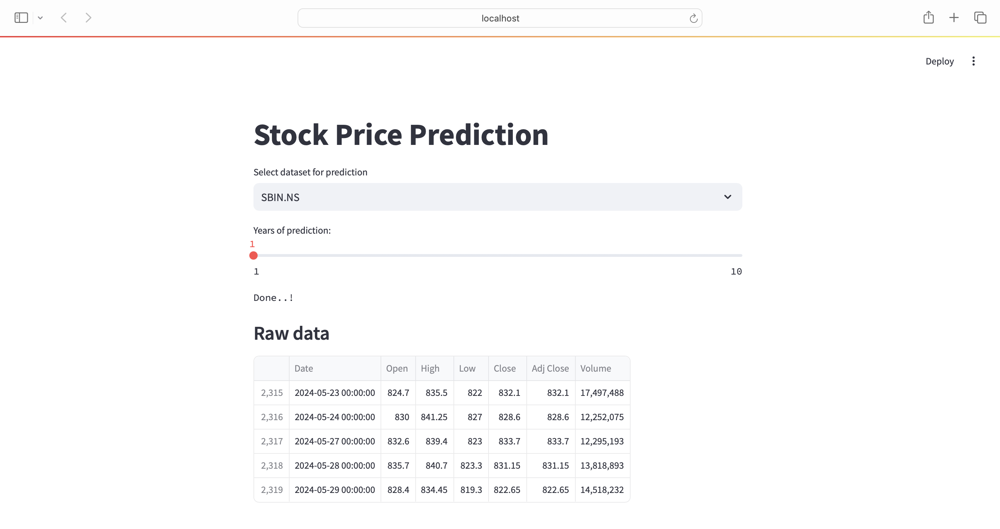

# Stock Price Prediction App

This Streamlit app predicts the future stock prices for selected companies using the Prophet model. It allows users to select a stock, view historical data, and generate forecasts for a specified number of years.




## Features

- **Select Stock Dataset**: Choose from a list of predefined stocks to predict.
- **Historical Data Display**: View the raw historical data for the selected stock.
- **Interactive Plots**: Visualize the historical stock prices with interactive plots.
- **Future Predictions**: Generate and display future stock price predictions using the Prophet model.
- **Forecast Components**: View components of the forecast such as trends and seasonality.

## Installation

1. **Clone the repository**:
    ```bash
    git clone https://github.com/yourusername/stock-price-prediction-app.git
    cd stock-price-prediction-app
    ```

2. **Create a virtual environment**:
    ```bash
    python -m venv venv
    ```

3. **Activate the virtual environment**:
    - On Windows:
        ```bash
        venv\Scripts\activate
        ```
    - On macOS/Linux:
        ```bash
        source venv/bin/activate
        ```

4. **Install the required packages**:
    ```bash
    pip install -r requirements.txt
    ```

## Usage

1. **Run the Streamlit app**:
    ```bash
    streamlit run app.py
    ```

2. **Open your web browser** and navigate to `http://localhost:8501` to access the app.

## File Structure

- `app.py`: Main application file containing the Streamlit app.
- `requirements.txt`: List of Python packages required to run the app.

## How It Works

1. **Data Fetching**: The app fetches historical stock data from Yahoo Finance starting from January 1, 2015, to the current date.
2. **Data Visualization**: Displays the raw data and an interactive plot of the historical stock prices.
3. **Model Training**: Uses the Prophet model to train on the historical stock price data.
4. **Forecasting**: Generates future stock price predictions based on the trained model.
5. **Plotting Forecasts**: Displays the forecasted stock prices and their components.

## Dependencies

- `streamlit`: For creating the web application.
- `yfinance`: For fetching historical stock data.
- `prophet`: For time series forecasting.
- `plotly`: For interactive data visualization.

## Contributing

Contributions are welcome! Please open an issue or submit a pull request for any improvements or bug fixes.

## License

This project is licensed under the MIT License - see the [LICENSE](LICENSE) file for details.

## Acknowledgements

- [Streamlit](https://streamlit.io/)
- [Yahoo Finance](https://finance.yahoo.com/)
- [Prophet](https://facebook.github.io/prophet/)
- [Plotly](https://plotly.com/)

